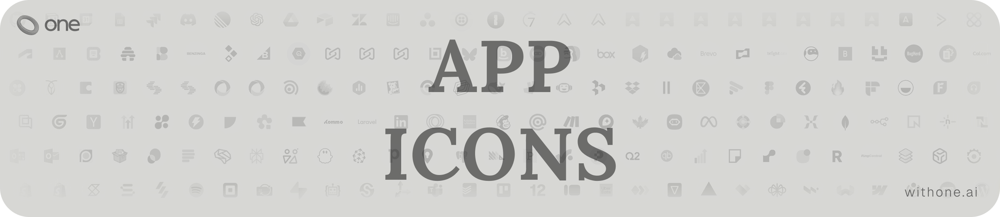

<h3 align="center">One App Icons</h3>
<p align="center">SVG logos for every platform on One.</p>

<p align="center">
  <a href="https://withone.ai"><strong>Website</strong></a>
  &nbsp;&middot;&nbsp;
  <a href="https://withone.ai/docs"><strong>Docs</strong></a>
  &nbsp;&middot;&nbsp;
  <a href="https://app.withone.ai"><strong>Dashboard</strong></a>
  &nbsp;&middot;&nbsp;
  <a href="https://withone.ai/changelog"><strong>Changelog</strong></a>
  &nbsp;&middot;&nbsp;
  <a href="https://x.com/withoneai"><strong>X</strong></a>
  &nbsp;&middot;&nbsp;
  <a href="https://linkedin.com/company/withoneai"><strong>LinkedIn</strong></a>
</p>

---

## About

This repository contains SVG icons for all platform integrations available on [One](https://withone.ai). Each icon is a clean, scalable SVG file located in the `logos/` directory.

## Structure

```
logos/
  ├── slack.svg
  ├── github.svg
  ├── stripe.svg
  ├── shopify.svg
  └── ... (237 icons)
```

## Naming Convention

Each SVG filename corresponds directly to its platform name. For example:

| Platform | File |
| --- | --- |
| Slack | `logos/slack.svg` |
| GitHub | `logos/github.svg` |
| Google Sheets | `logos/google-sheets.svg` |
| HubSpot | `logos/hubspot.svg` |

Multi-word platform names are lowercase and hyphen-separated (e.g., `google-calendar.svg`, `click-up.svg`).

## Programmatic Access

You can retrieve the full list of available platforms via the [List Connectors](https://www.withone.ai/docs/api-reference/connectors/list_connectors) API endpoint. The `platform` field in the response maps directly to the SVG filename in this repo:

```
logos/{platform}.svg
```

## License

Copyright &copy; [One](https://withone.ai). All rights reserved.
